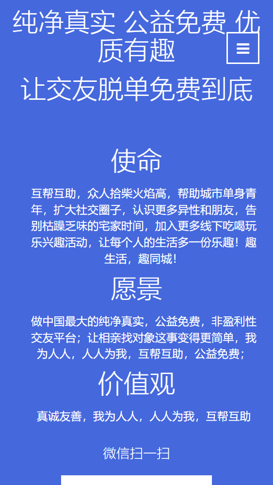
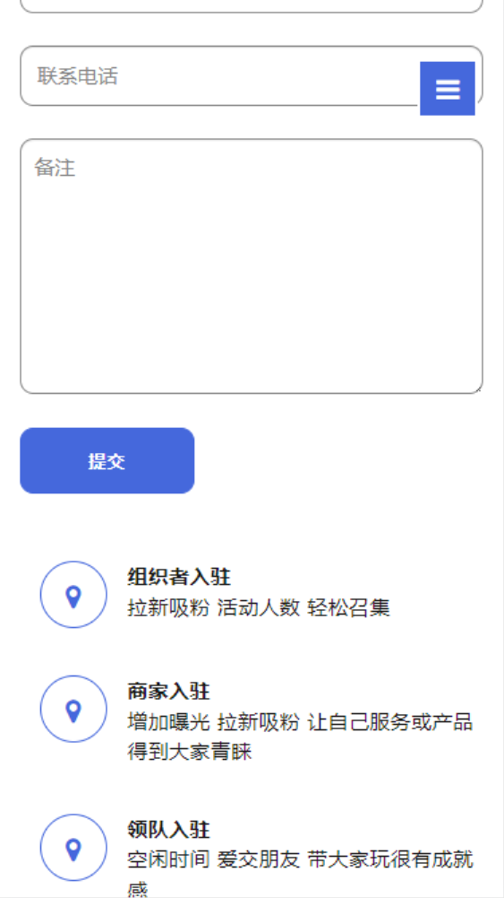
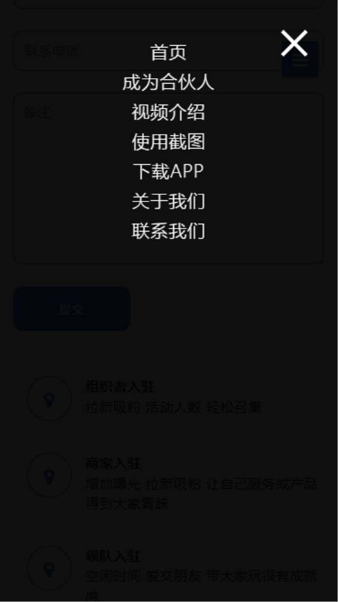

# quju_website

#### 介绍
小猪趣聚APP 推广官网，喜欢的朋友可以复制此模板，基于二次开发即可；可商用或个人使用；
* 预览请点击    [gitee预览](https://xww520.gitee.io/quju_website)

#### 软件架构
html官网，支持PC + 手机H5浏览，响应式页面

#### h5部分截图
| | |
| ---- | ---- |
| | |

#### 安装教程

1.  部署到nginx即可，或者下载整个包到本地，也可以浏览；记得给个star哦

#### 使用说明

1.  直接进入nginx服务器，查看静态页面，入口是index.html

#### 参与贡献

1.  Fork 本仓库
2.  新建 Feat_xxx 分支
3.  提交代码
4.  新建 Pull Request

#### 特技

1.  使用 Readme\_XXX.md 来支持不同的语言，例如 Readme\_en.md, Readme\_zh.md
2.  Gitee 官方博客 [blog.gitee.com](https://blog.gitee.com)
3.  你可以 [https://gitee.com/explore](https://gitee.com/explore) 这个地址来了解 Gitee 上的优秀开源项目
4.  [GVP](https://gitee.com/gvp) 全称是 Gitee 最有价值开源项目，是综合评定出的优秀开源项目
5.  Gitee 官方提供的使用手册 [https://gitee.com/help](https://gitee.com/help)
6.  Gitee 封面人物是一档用来展示 Gitee 会员风采的栏目 [https://gitee.com/gitee-stars/](https://gitee.com/gitee-stars/)
